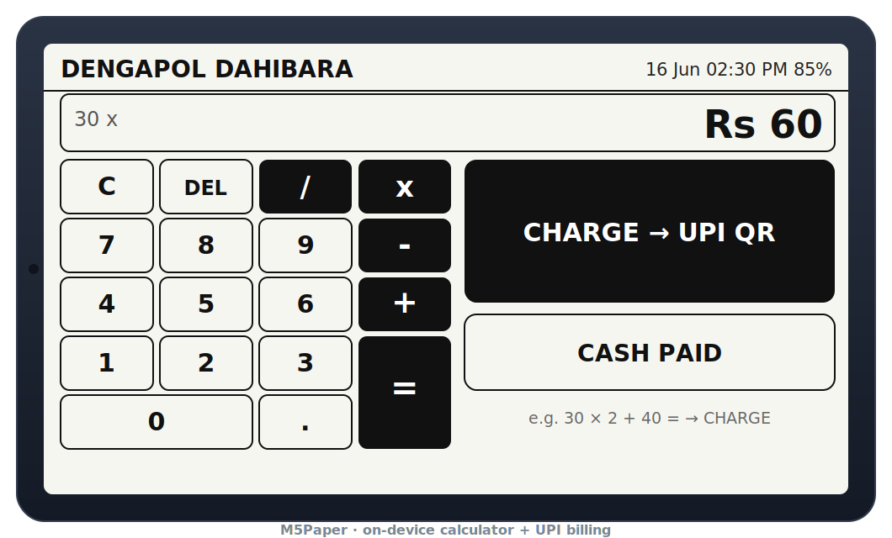
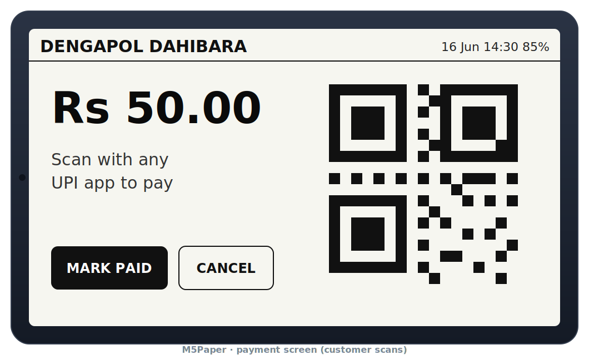
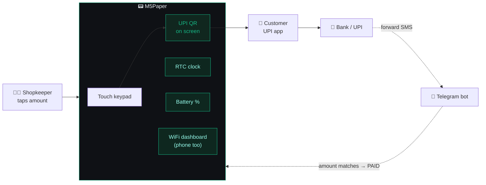

<!-- ============================ HEADER ============================ -->
<p align="center">
  
</p>

<p align="center">
  
</p>

<p align="center">
  
  
  
  
  
  
</p>

<p align="center"><b>PaperPay, ported to the M5Paper</b> — a self-contained payment terminal. Bill on the<br/>device's touchscreen, show a big UPI QR to the customer, and log every sale.<br/>Reuses all of <a href="../">PaperPay</a>'s logic; only the display + touch layer is new.</p>

<!-- ============================ SCREENS ============================ -->
<table align="center"><tr>
  <td align="center"><br/><sub>① Bill with the on-device calculator</sub></td>
  <td align="center"><br/><sub>② Customer scans the QR</sub></td>
</tr></table>

---

## 🤔 How it works



A bill becomes **Paid** in any of three ways: tap **MARK PAID**, tap **CASH PAID**, or
forward the bank/UPI "credited ₹X" SMS into Telegram (it matches the amount and
marks the bill paid automatically, flipping the screen to ✓ Paid).

---

## ✨ On the device
- 🧮 **On-device calculator** (`+ − × ÷ =`) — e.g. `30 × 2 + 40` → **CHARGE** (UPI QR) or **CASH PAID**
- 🧾 **Big QR** facing the customer; **MARK PAID / CANCEL**
- 🕒 **Date + time** (onboard RTC) and 🔋 **battery %** in the header
- 📱 Phone/PC dashboard still served over WiFi (calculator, payments log, settings)
- 🤖 Telegram alerts + **auto‑confirm** from a forwarded payment SMS

## 🔧 Hardware
| | |
|---|---|
| Board | **M5Stack M5Paper** (ESP32‑D0WDQ6, 4.7" IT8951 e‑ink 960×540, GT911 touch, RTC, battery) |
| Library | **M5Unified + M5GFX** (also covers M5PaperS3 — just change the board id) |
| Power | USB‑C / built‑in battery |

> No wiring — everything is integrated. Just flash and go.

## 🚀 Build & flash
```bash
pio run -t uploadfs     # dashboard (data/) → LittleFS
pio run -t upload       # firmware
pio device monitor
```
Optional: copy `include/wifi_secrets.h.example` → `wifi_secrets.h` and add your
WiFi to auto‑connect on boot (git‑ignored). Otherwise join the
**`M5PaperPay-Setup`** hotspot on first boot to configure WiFi + UPI ID.

## 🧩 What's reused vs new
| Reused verbatim from PaperPay | M5Paper‑specific |
|---|---|
| `config` · `qrpay` · `store` · `web` · `telegram` · `netctl` · dashboard `data/` | `display_m5.cpp` (M5GFX render + touch UI) · `main.cpp` |

<p align="center"><sub>Part of <a href="../">PaperPay</a> · MIT</sub></p>


