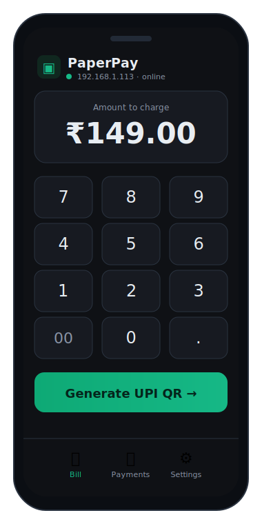
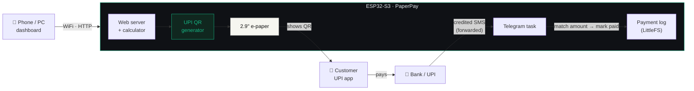
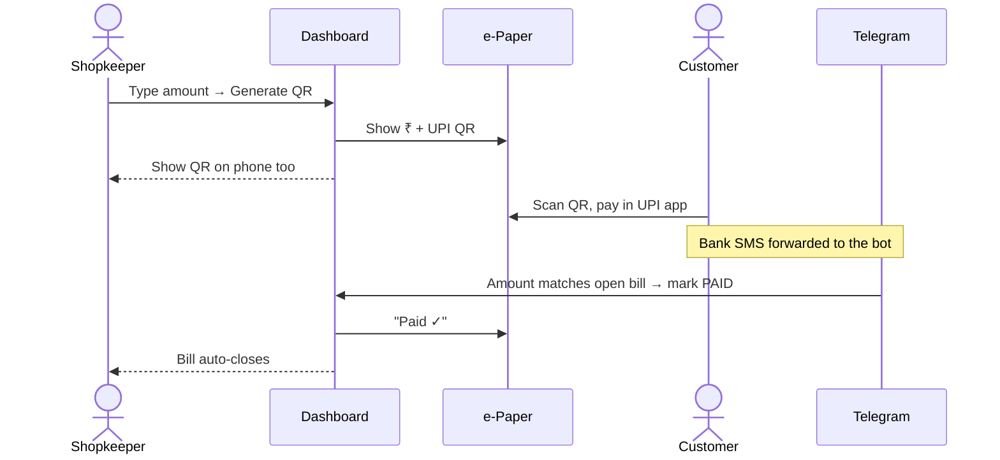

<!-- ========================== HEADER ========================== -->
<p align="center">
  
</p>

<p align="center">
  
</p>

<p align="center">
  
  
  
  
  
  
</p>

<p align="center"><b>A tiny self-hosted payment counter.</b> An ESP32-S3 hosts a mobile dashboard over WiFi, builds a <br/><code>upi://pay</code> QR for the billed amount, shows it on a 2.9" e-paper facing the customer, and logs every sale.</p>

<!-- ========================== HERO ========================== -->
<table align="center"><tr>
  <td align="center" width="62%"><br/><sub>Customer-facing e-paper</sub></td>
  <td align="center" width="38%"><br/><sub>Phone / PC dashboard</sub></td>
</tr></table>

---

## 🖥️ Two hardware builds

| Build | Hardware | Highlights |
|---|---|---|
| **PaperPay** (this folder) | ESP32‑S3‑N16R8 + Waveshare 2.9" e‑paper | Cheapest; bill from the phone dashboard |
| **[M5PaperPay](M5paperpay/)** | M5Stack **M5Paper** (4.7" e‑ink, touch, RTC, battery) | **Bill on the device** (calculator + QR), portable |

<table align="center"><tr>
  <td align="center"><br/><sub>PaperPay — ESP32‑S3 + Waveshare 2.9"</sub></td>
  <td align="center"><br/><sub>M5PaperPay — M5Paper calculator + UPI</sub></td>
</tr></table>

Both share the same logic (web dashboard, UPI QR, payment log, Telegram). See
**[`M5paperpay/`](M5paperpay/)** for the M5Paper port.

---

## ✨ Features

| | |
|---|---|
| 📱 **Mobile dashboard** | Calculator + keypad, works in any browser — no install. |
| 🧾 **UPI QR on demand** | Builds `upi://pay?...` and renders the QR on the e-paper **and** on screen. |
| 🖥️ **Sunlight-readable e-paper** | Customer-facing amount + QR, ultra-low power. |
| 🤖 **Telegram bot** | Bill & paid alerts, `/today` `/pending` commands. |
| ✅ **Auto-confirm payments** | Forward your bank/UPI "credited ₹X" SMS → the matching bill is **auto-marked paid**, e-paper flips to *Paid*, dashboard QR closes itself. |
| 📜 **Payment manager** | Today's sales, pending vs paid, full log on flash. |
| ⚙️ **Captive-portal setup** | First boot opens a `PaperPay-Setup` hotspot for WiFi + UPI details. |
| 📶 **WiFi from the dashboard** | Scan & switch networks, reboot, factory-reset — no re-flash. |

---

## 🧠 How it works



<details>
<summary><b>💳 A sale, step by step</b></summary>


</details>

---

## 🔌 Wiring — Waveshare 2.9" → ESP32-S3

<details open>
<summary><b>Pin map</b> (defaults in <code>include/config.h</code>)</summary>

| e-Paper | Cable | ESP32-S3 | | e-Paper | Cable | ESP32-S3 |
|---|---|---|---|---|---|---|
| **VCC** | 🔴 | `3V3` | | **DC**  | 🟢 | `GPIO 9` |
| **GND** | ⚫ | `GND`  | | **RST** | ⚪ | `GPIO 8` |
| **DIN** | 🔵 | `GPIO 11` | | **BUSY**| 🟣 | `GPIO 7` |
| **CLK** | 🟡 | `GPIO 12` | | | | |
| **CS**  | 🟠 | `GPIO 10` | | | | |

> ⚠️ **VCC = 3.3 V only.** Power the board from a real wall charger, not a weak USB port.
</details>

---

## 🚀 Quick start

```bash
pio run -t uploadfs     # upload the dashboard (data/) to LittleFS
pio run -t upload       # flash the firmware
pio device monitor      # watch the logs
```

1. Power on → e-paper shows **Join AP `PaperPay-Setup`**.
2. Join that WiFi on your phone → enter your WiFi + **UPI ID / payee / shop name**.
3. It reboots, joins your WiFi, shows its IP → open `http://<that-ip>` and start billing.

> 💡 **N16R8 must build with `board_build.arduino.memory_type = qio_opi`** (octal PSRAM) — otherwise it boot-loops in `psramInit()`. Already set in [`platformio.ini`](platformio.ini).

<details>
<summary><b>🤖 Telegram setup</b></summary>

1. `@BotFather` → `/newbot` → copy the **token**.
2. Message your bot once; get your **Chat ID** (e.g. via `@userinfobot`).
3. Dashboard → **Settings → Telegram** → paste token + chat ID → **Enable** → **Save** → **Send test**.
4. Forward a bank/UPI payment SMS into the chat to auto-confirm a matching bill.

> Some ISPs DNS-block Telegram — the firmware connects to Telegram's IP directly to get around it.
</details>

<details>
<summary><b>🔗 REST API</b></summary>

| Method | Path | Purpose |
|---|---|---|
| `GET` | `/api/state` | device + shop info |
| `GET/POST` | `/api/config` | shop + Telegram settings |
| `POST` | `/api/pay` | `{amount,note}` → create bill, show QR |
| `POST` | `/api/paid` · `/api/cancel` | `{id}` update a bill |
| `GET` | `/api/transactions` · `/api/txn?id=` | log / single bill |
| `GET` | `/api/qr.svg?data=` | on-screen QR (offline) |
| `GET` | `/api/wifi[/scan]` · `POST /api/wifi/connect` | WiFi management |
</details>

---

## 🛠️ Built with

<p align="center">
  
  
  
  
  
  
</p>

```
include/ + src/   config · qrpay · display · store · web · telegram · netctl · main
data/             dashboard SPA  (index.html · style.css · app.js)
assets/           README artwork
```

<p align="center"><sub>MIT — use it, fork it, run your shop on it. Made with ☕ + 🤖.</sub></p>


